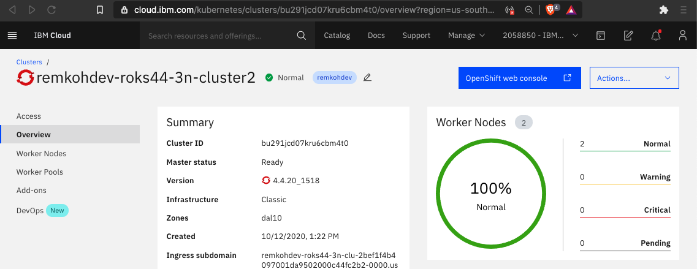
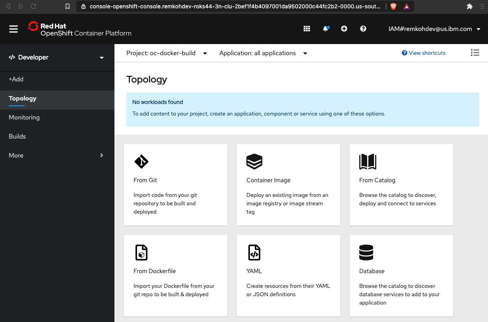
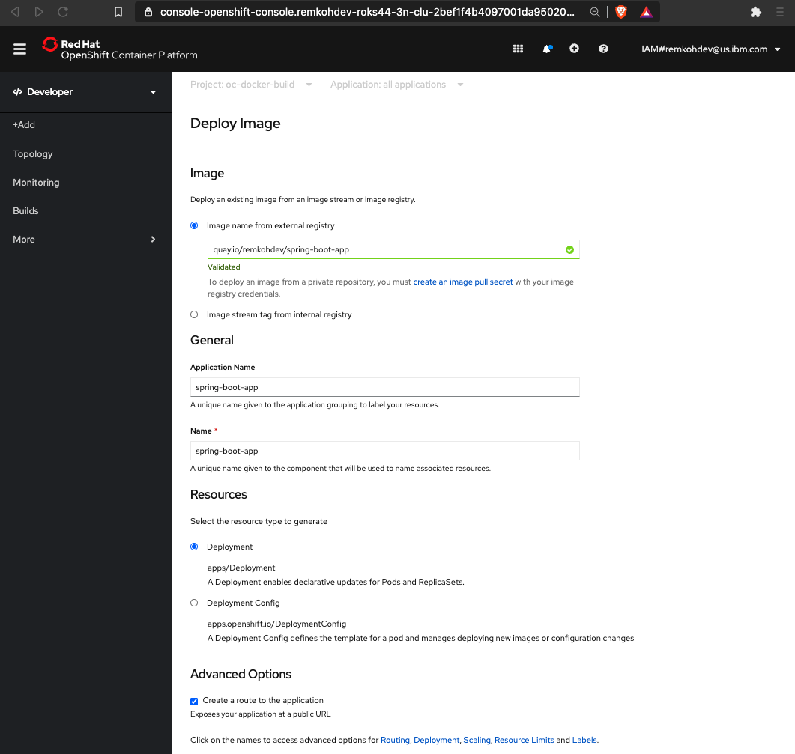
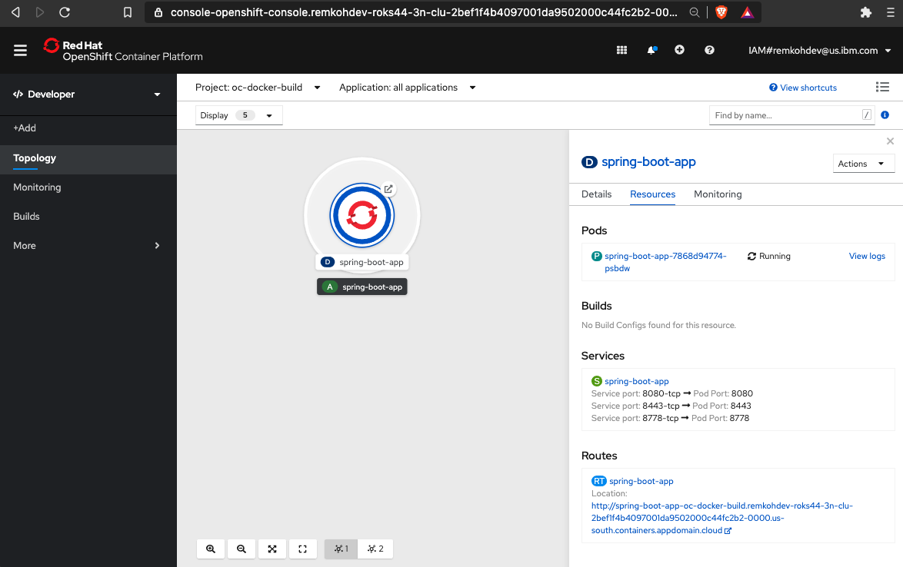

# Docker Build Strategy

One of the build and deployment strategies on OpenShift is the `Docker build` strategy. A `build` is the process of transforming source code into a runnable image. The `deployment` uses the runnable image to deploy an application to a runtime environment. 

To define the build process OpenShift uses a `BuildConfig`. The `Docker build` strategy invokes the docker build command, and it expects a repository with a Dockerfile and all required artifacts in it to produce a runnable image. A `DeploymentConfig` is a way to create a `ReplicationController` and a strategy to start up `pods` on OpenShift.

This lab guides you through the steps to implement the Docker build strategy on OpenShift to deploy an example application called `spring-boot-app`.

### Pre-requirements

For this tutorial, you need access to among other aDocker and oc client with a Docker Engine. I strongly recommend to use the terminal that is part of the Theia Cloud IDE (with Docker) environment at https://labs.cognitiveclass.ai.

To access the terminal that is part of Theia — Cloud IDE (With Docker) at Cognitive Class:

1. Go to https://labs.cognitiveclass.ai ,
1. Sign up for CognitiveClass.ai using an IBM id or use your favorite social login,
1. Login with your IBM Id or social login,
1. Select Theia - Cloud IDE (With Docker),
1. Select Terminal > New Terminal.
1. Test you have access to the required clients,

    ```console
    oc version
    git version
    mvn -v
    docker version
    curl --version
    ```

### Get Source Code

1. Clone the `spring-boot-app` repository,

    ```console
    git clone https://github.com/remkohdev/spring-boot-app.git
    cd spring-boot-app
    ```

### Test Maven Build

1. Test maven build

    ```console
    mvn clean install
    ```

### Test Docker Image

1. Create the following Dockerfile,

    ```console
    cat > Dockerfile <<EOF
    ARG JAR_FILE=target/*.jar

    # build stage
    FROM registry.access.redhat.com/ubi8/openjdk-11
    COPY . .
    USER root
    RUN mvn clean install -DskipTests

    # runtime stage
    FROM registry.access.redhat.com/ubi8/openjdk-11
    COPY --from=0 /home/jboss/target/*.jar /home/jboss/app.jar
    ENTRYPOINT ["java","-jar","app.jar"]
    EOF
    ```

    **Note**: the `mvn clean` requires root access to delete the files in target. Starting a new stage, will reset the user to the default non-root user in the `ubi` image.

1. Build and push the container image,

    ```console
    docker build -t spring-boot-app .
    ```

2. Run the container,

    ```console
    docker run --name spring-boot-app -d -p 8080:8080 spring-boot-app
    curl -X GET "http://localhost:8080/api/hello?name=Kumar"
    ```

3. Inspect, stop and remove image,

    ```console
    docker ps -a
    docker logs spring-boot-app
    docker stop spring-boot-app
    docker rm spring-boot-app
    ```

4. Push image to remote registry,

    ```console
    docker tag spring-boot-app quay.io/remkohdev/spring-boot-app
    docker login quay.io -u remkohdev@gmail.com
    docker push quay.io/remkohdev/spring-boot-app
    ```

5.  Go to quay.io > repositories > spring-boot-app > Settings > Repository Visibility > make repository public

### Deploy to OpenShift from an Existing Image

You can deploy applications directly from the OpenShift Web Console,

1. Login to your OpenShift cluster,
1. On IBM Cloud, list your Kubernetes clusters, select your cluster to go to your cluster Dashboard, and click the button Open Web Console > in the OpenShift Web Console, you can copy the login command under your profile icon, a new page will pop open with Display Token, click the link and copy the login command, e.g.

    ```console
    oc login --token=abc --server=https://c321d.us-east.containers.cloud.ibm.com:31333
    ```

1. Create a new project,

    ```console
    oc new-project oc-docker-build
    ```

1. Go to the OpenShift Web Console,

    

1. Switch to `Developer` mode,
1. Go to `Topology` or click the `+Add` link,

    

1. Select `Container Image`, and configure the `Deploy Image`,
   1. `Image name from external registry`: quay.io/<username>/spring-boot-app,
   2. `Application Name`: spring-boot-app,
   3. `Name`: spring-boot-app,
   4. Under `Resources` select `Deployment`,
   5. Check the `Advanced Options` for `Create a route to the application`,

    

1. Click `Create`,

    

1. Your application is running and is available via the Route.
1. Clean up,

    ```console
    oc delete project oc-docker-build
    ```

### Deploy to OpenShift

1. Create a new project,

    ```console
    oc new-project oc-docker-build
    ```

2. Deploy the application from source with `Docker build` strategy using the Dockerfile,

    ```console
    oc new-app . --strategy=docker
    ```

3. Verify the resources were created successfully,

    ```console
    oc get bc
    oc get builds
    oc get dc
    ```

4. Create a Route,

    ```console
    oc expose svc spring-boot-app
    ROUTE=$(oc get routes -o json | jq -r '.items[0].spec.host')
    ```

5. Test deployment, 

    ```console
    curl "http://$ROUTE/api/hello?name=Tao"
    ```

## About Multi-stage Builds

When you start containerizing an application, it is common to start with one Dockerfile for building images and running containers. It is common to have one Dockerfile for development, and a minimal image for production. This has been referred to as the `builder pattern`, but maintaining two Dockerfiles is not ideal.

In `multi-stage builds`, you use multiple `FROM` statements in your Dockerfile. Each `FROM` statement begins a new stage of the build. You can selectively copy artifacts from one stage to another.

Compare `Dockerfile2` to `Dockerfile`.